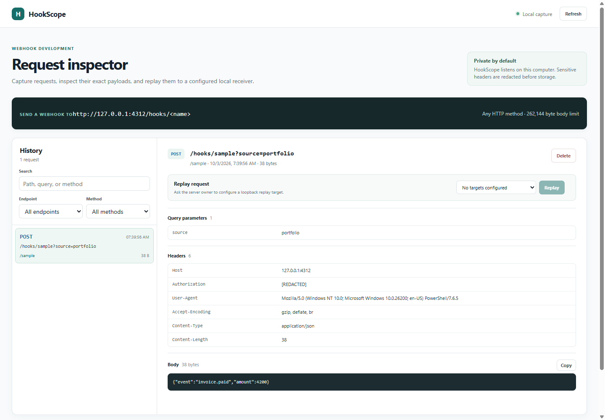

# HookScope

HookScope is a self-hosted webhook inspection service for local development. It captures any HTTP method and preserves the request path, query, ordered headers, and raw body. A small dashboard lets you filter recent requests, inspect details, remove captures, and replay a captured request to a configured loopback receiver.

HookScope is a local debugging tool, not a public webhook relay. It binds to `127.0.0.1`, has no user accounts or authentication, and grants anyone who can reach the listener access to captured request data, deletion, and configured replay. Keep it on a trusted machine. The data directory can contain sensitive payloads. Sensitive headers are redacted before storage; bodies and URL query values are retained as sent.

## Requirements and start

Node.js 22.14 or newer is required. HookScope has no npm runtime dependencies and uses Node's built-in `node:sqlite` API, which is experimental in Node 22.14. The checked-in minimum version was exercised locally.

```sh
npm ci
npm start
```

Open <http://127.0.0.1:4173>. Send a request to `http://127.0.0.1:4173/hooks/<name>`; for example:

```sh
curl -i -X POST 'http://127.0.0.1:4173/hooks/billing?source=local' \
  -H 'Content-Type: application/json' \
  -H 'Authorization: Bearer example-secret' \
  --data '{"event":"invoice.paid","amount":4200}'
```

The service returns `202` with a capture ID. `Authorization` is stored as `[REDACTED]`; the body and query remain available in the dashboard and API.

## Configuration

Copy `.env.example` values into your shell or process manager; HookScope does not load `.env` files automatically.

| Variable                   | Default     | Purpose                                                                                             |
| -------------------------- | ----------- | --------------------------------------------------------------------------------------------------- |
| `HOOKSCOPE_HOST`           | `127.0.0.1` | Loopback listener address only: localhost, literal 127.x.x.x, or ::1. Other addresses are rejected. |
| `HOOKSCOPE_PORT`           | `4173`      | HTTP port.                                                                                          |
| `HOOKSCOPE_DATA_DIR`       | `./data`    | Directory containing `hookscope.sqlite`.                                                            |
| `HOOKSCOPE_MAX_BODY_BYTES` | `262144`    | Maximum captured request body; allowed range is 1 KiB to 2 MiB.                                     |
| `HOOKSCOPE_MAX_CAPTURES`   | `500`       | Maximum retained captures; oldest rows are deleted when new ones arrive.                            |
| `HOOKSCOPE_MAX_DB_BYTES`   | `268435456` | SQLite page limit; allowed range is 16 MiB to 1 GiB.                                                |
| `HOOKSCOPE_REPLAY_TARGETS` | `[]`        | JSON allowlist of replay destinations. Empty disables replay.                                       |
| `HOOKSCOPE_REDACT_HEADERS` | empty       | Comma-separated extra exact header names to redact.                                                 |

Replay is disabled until configured. Each target has an ID, label, and exact request URL:

```json
[
  {
    "id": "local-api",
    "label": "Local API",
    "url": "http://127.0.0.1:9000/webhooks/example"
  }
]
```

Provide that JSON string as `HOOKSCOPE_REPLAY_TARGETS`. URLs must use HTTP(S), literal `127.x.x.x` or `::1` addresses, and no credentials, query, or fragment. Host names such as `localhost` are intentionally rejected so replay does not depend on DNS resolution. The replay API accepts only a configured target ID; it never accepts a destination URL from a caller. Redirects are returned to the dashboard but not followed. Responses are read up to 8 KiB. Replay has a five-second timeout.

HookScope forwards the captured method and body to the configured URL. It omits hop-by-hop headers, host and content length, and any header value that was redacted at capture time. Configure a target for one local receiver endpoint; captured request paths are not appended to its URL.

## Storage and limits

Captures are stored in a SQLite database using full synchronous commits and WAL mode. Retention is bounded by both `HOOKSCOPE_MAX_CAPTURES` and SQLite's page limit. The defaults allow the configured 500 captures at the default 256 KiB request-body cap, with space for metadata and indexes. If storage reaches its page limit, HookScope returns `507` and keeps the existing capture history. Monitor the data directory and adjust limits together with available disk space. `secure_delete` is enabled, and the WAL is checkpointed on a clean shutdown.

Request bodies are read incrementally and rejected with `413` above the configured body cap. HTTP request timeout is 30 seconds. The dashboard returns at most 100 history entries per request. The API has no CORS access and sends restrictive content-security headers.

By default, HookScope redacts header names containing authorization, cookie, token, secret, password, credential, API key, session, or signature. Extra exact names can be listed in `HOOKSCOPE_REDACT_HEADERS`. Redaction happens before SQLite storage. Header order and duplicate names are preserved. Query values and request bodies are not redacted, so inspect the trust and retention needs of the systems you send here.

## HTTP API

- `GET /api/health` — basic health and body limit.
- `GET /api/targets` — configured replay target IDs and labels (destination URLs are not exposed).
- `GET /api/captures?limit=50&endpoint=billing&method=POST&q=invoice` — filter recent history. `limit` is 1–100 and `q` searches path, raw query, endpoint, and method.
- `GET /api/captures/:id` — capture details, redacted headers, query pairs, body text when appropriate, and base64 body.
- `DELETE /api/captures/:id` — remove a capture.
- `POST /api/captures/:id/replay` with `{"targetId":"local-api"}` — replay to an allowlisted loopback destination.
- `ANY /hooks/:name` — capture a request under the supplied endpoint name.

## Development

```sh
npm ci
npm run check
npm test
```

Tests use temporary databases and local HTTP receivers to exercise persistence, filtering, redaction, request limits, retention, replay allowlisting, and redirect handling.

## Preview

Synthetic example data from the local browser check.



## Repeatable browser acceptance

```sh
npx playwright install chromium
npm run test:e2e
```

The tests launch an isolated local server, run desktop and mobile Chromium
contexts, and check actual user flows rather than mocked APIs. Persistent service
data uses a fresh `.playwright-data` location. Failure traces/screenshots are
captured under `test-results`; neither directory belongs in source control.
These checks cover the browser build, not native Android/iOS behavior.
